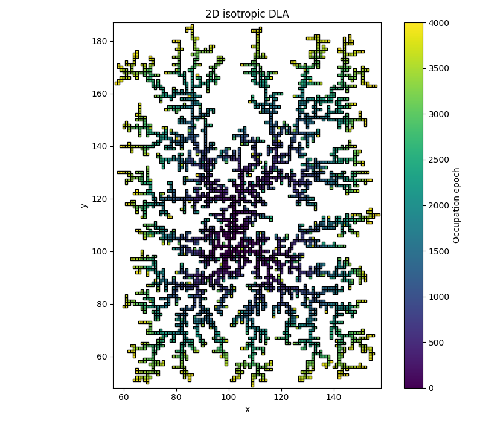
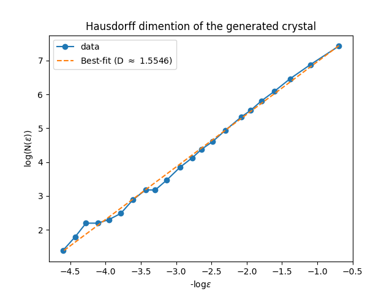
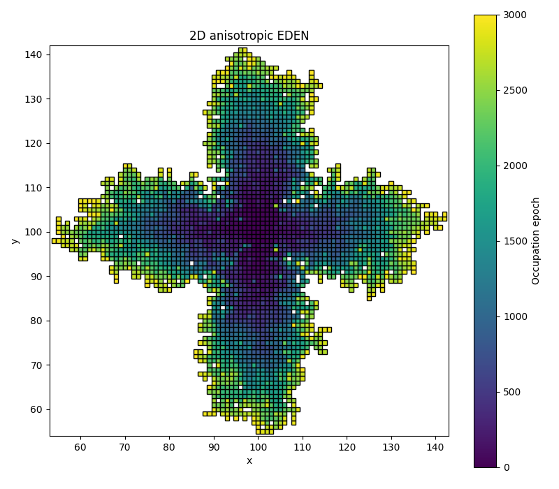
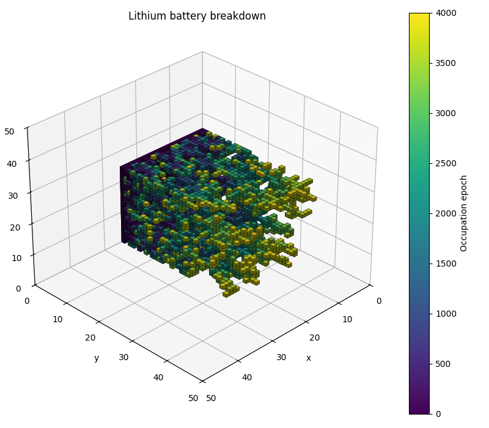
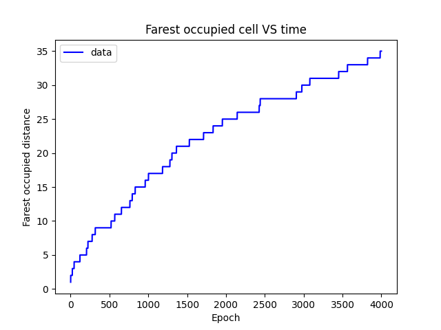

# Crystal-growth
This software is a lattice–based simulator for the growth of crystalline structures under different kinetic regimes, inspired by this paper[^1]. # TODO: new cite
It implements various growing regimes, in both 2D and 3D. The regimes implemented in this software are:
   * EDEN growth: isotropic growth into a saturated enviroment
   * DLA growth: diffusion limited growth, where new particles reach the crystal via a random walk
   * KOBAYASHI growth: growth into a saturated enviroment, taking into account crystal surface tension
   * MULLINS growth: growth into an enviroment whose saturation depends on a phisical field (temperature, concentration, ...) and on crystal surface tension
 
The software allows both a quantitative analysis, by computing relevant properties, and qualitative analysis, by plotting the final crystal, so that the user can directly see its final structure.


## Introduction
Crystals are solids where the building units, called *monomers* sit in a periodically ordered structure, repeating in space like a tiling. This long–range order is what gives crystals well–defined faces, sharp melting points, and very directional physical properties.

The main physical phenomena in which these objects are involved are:
* **Nucleation** - the birth of a new crystal from a melt, solution, or vapor: small clusters form, most die, a few exceed a critical size and become stable nuclei.
* **Growth** - atoms or molecules attach to the crystal surface, often controlled by diffusion (how fast stuff arrives) and interface kinetics (how fast it actually sticks and reorganizes).
* **Anisotropy** - because the lattice is not the same in every direction, properties like growth rate, surface energy, conductivity, optical index, etc. depend on orientation.
* **Defects** - vacancies, dislocations, impurities and grain boundaries break perfect order; they control mechanical strength, plasticity, transport, and often where and how growth proceeds.
* **Phase transitions** - crystals can melt, transform into other crystalline phases, or undergo order–disorder transitions when temperature, pressure, or composition change.

## Lattice implementation
### Base KineticLattice
### KineticLattice
The system is defined on a discrete cubic lattice

$$\Lambda = \{(x,y,z) | x=0,\dots,N_x-1, y=0,\dots,N_y-1, z=0,\dots,N_z-1\}$$

Each site carries:
* an **occupancy** variable $n(\mathbf{r}) \in [0,1], \quad \mathbf{r} = (x,y,z)$  
The meaning of the value depends on the simulation logic: for kinetic growth (EDEN, DLA) 0 means empty cell and 1 means occuied. For phase field growth (KOBAYASHI, MULLINS) the value is continuous, with 0 being liquid phase, 1 being solid phase, and the values in between accounts for the dynamics of the interface.
* an **hisotry** field $h(\mathbf{r}) \in \{-1,1,2,\dots \}$  
where $h(\mathbf{r})=-1$ for empty sites, and $h(\mathbf{r})=t$ if the site was occupied at time step $t$.
* an **id** field $id(\mathbf{r})$, used to mimic different cristalline domains.
* an optional **crystal seed set** $S_0 \subset  \Lambda$, used to define the initial occupied regions.
TODO: continue

### PhaseFieldLattice

## Growth models
### EDEN growth
The Eden model implemented here describes growth controlled primarily by the interface kinetics: the crystal expands by occupying sites on its active border.

At each epoch $t$:
1. Compute the active border $B(t)$.
2. Select a site $\mathbf{r} \in B(t)$ with a probability $P(\mathbf{r})$.
3. Set $n(\mathbf{r})=1$ and $h(\mathbf{r}) = t$.

In the isotropic case, all border sites are equivalent, having each a probability:

$$P(\mathbf{r}) = \frac{1}{|B(t)|}$$

With anisotropy enabled, $P(\mathbf{r})$ is biased using a lattice-stored anisotropy weight $w(\mathbf{r})$, so that

$$P(\mathbf{r}) = \frac{w(\mathbf{r})}{\sum_{\mathbf{r'} \in B(t)} w(\mathbf{r'})}$$

The simulator supports both fully 3D and 2D EDEN growth, with the 2D version having the $z$-plane fixed..

### DLA growth
The DLA model describes growth limited by particle transport: particles diffuse in the empty region via random walk, and irreversibly attach to the crystal when they reach its neighborhood.

For each new particle in the simulation:
1. Define a **generation bounding box** around the crystal, with padding $p_{gen}$.  
   A random starting position $mathbf{r}_0$ is selected on the surface of this box.
2. Define a **outer bounding box** with larger padding $p_{out} > p_{gen}$.  
   If the particle exits this region or exceeds a maximum number of steps, its walk is restarted from a new random generation point.
3. From $\mathbf{r}_0$, perform a random walk: $\mathbf{r}_{t+1} = \mathbf{r}_t + \mathbf{\Delta r}_t$  
   where $\mathbf{\Delta r}_t$ is the nearest-neighbor step, chosen according to a probability distribution that can be isotropic or not.
4. If at a given step the particle position $\mathbf{r}_t$ has at least one occupied neighbor, the particle sticks to the crystal. The walk ends and the simulator proceeds with the next particle.

The simulator collects simple statistics on the random walk, such as mean number of steps and mean number of restarts per attached particle.

### Kobayashi growth


### Mullins growth


## Outputs and Analysis tools
The software includes basic analysis utilities, including:
* **Fractal dimention estimation** of DLA clusters via box-counting over multiple length scales: if $N(l)$ is the number of occupied boxes of side $l$, the dimension $D_f$ is estimated from:

$$N(l) \approx l^{-D_f}$$

* **Distance from active surface analysis**, used in a built-in simulation, quantifying how far occupied sites are from the initial growth plane as a function of epoch.

These tools are intended to provide quick quantitative diagnostics of the generated morphologies.


## Repository Structure


## Getting Started
This software is tested working in the python 3.10 version.

1. Clone the repository: inside the target directory, clone this repo by writing the following in the command prompt
``` 
git clone https://github.com/MatteoAgu12/Crystal-growth
``` 
If the repository has been successfully installed, you should be able to see it after entering the following command in the terminal
``` 
ls
``` 

2. Move to the software directory with
``` 
cd ./Crystal-growth/
``` 
and install all the required dependencies by executing (*pip* version, use your enviroment otherwise)
``` 
pip install -r requirements.txt
```

By doing these few steps you should be ready to use the software on your machine.


## Tutorials
The usage of this software is very easy, and to help the user to learn the main features the following short tutorials are provided, covering all the possibilities offered by this work.

### Create and use a $\texttt{KineticLattice}$ object
The $\texttt{KineticLattice}$ class is the very core of this project.
It provides a 3D enviroment in which perform the simulations under the conditions set by the user.  
Let's start by importing the class and creating an object of this class with fixed sizes:
```
from KineticLattice import KineticLattice

NX = 100
NY = 50
NZ = 120

MY_LATTICE = KineticLattice(number_of_cells_x = NX, number_of_cells_y = NY, number_of_cells_z = NZ)
```
At this point the lattice is empty.
To start a growth you need to set at least one nucleation seed.
Nucleation seeds are ment to be the step 0 of any simulation.  
Let's add a nucleation seed to our object, for example at point (50, 25, 60), which is the center of our crystal:
```
MY_LATTICE.set_nucleation_seed(x=50, y=25, z=60)
```
The list of the nucleation seeds set can be obtained via:
```
seeds_array = MY_LATTICE.get_nucleation_seeds()
```
By default, the growth of out crystal is isotropic.
To add an anisotropy effect, we need to define some preferenced directions, together with an anisotropy strenght:
```
x_dir = (1,0,0)
y_dir = (0,1,0)
anisotropy_directions = np.array([x_dir, y_dir])
anisotropy_strength = 1.5

MY_LATTICE.setAnisotropy(directions=anisotropy_directions, strength=anisotropy_strength)
```
To remove the anisotropy, use:
```
MY_LATTICE.clearAnisotropy()
```

Now, let's go through some methods to get the status of the lattice or of a specific cell:
```
X = 70
Y = 20
Z = 80

# Check if a point in space is inside the lattice
is_inside = MY_LATTICE.is_point_inside(X, Y, Z)

# Get the coordinates of all 6 neighbors of a cell
neighbors = MY_LATTICE.get_neighbors(X, Y, Z)

# Check if a cell of the lattice is occupied or not
is_occupied = MY_LATTICE.is_occupied(X, Y, Z)

# Get the active border of the crystal
active_border = MY_LATTICE.get_active_border()

# Get the bounding box of the crystal
crystal_bbox = MY_LATTICE.get_crystal_bounding_box()
crystal_bbox_with_padding = MY_LATTICE.get_crystal_bounding_box(padding = N)  # same but with an extra padding of N cells

```

During a growth simulation, more and more cells have to be occupied.  
In a built-in simulation this is done automatically, but in you custom simulation you have to do it manually. The way to do so is:
```
MY_LATTICE.occupy(X, Y, Z, group_id)
```

### Run a built-in simulation
The software offers some built-in simulations the user can use.

To execute them, you have to execute the file $\texttt{main.py}$ with some extra parameters (their order is irrelevant).  
All the instructions are below, but you can have a look at all the possible commands directly in the terminal by typing:
```
python main.py --help
```

To select which simulation you want to do:
```
--simulation EDEN       # to perform an EDEN simulation 
--simulation DLA        # to perform a DLA simulation 
--simulation SURFACE    # to perform an ACTIVE SURFACE simulation 
```

To set all the parameters of the chosen simulation (examples with arbitrary values):
```
--epochs 3000                          # Number of particles to deposit on the crystal
--size 100 100 100                     # Size of the KineticLattice object (must be three values: sizeX, sizeY, sizeZ)
--2D                                   # If present it simulates a 2D crystal, otherwise it's 3D 
--title "My simulation"                # Title of the simulation
--output "Results"                     # Directory where to save the results of the analysis
--anisotropy-directions 1 0 0 0 0 1    # Anisotropy directions (must be in groups of three: x, y, z)
--anisotropy-strength 2.3              # Anisotropy strength
--verbose                              # If present, it prints extra informations during the simulation (slower, but you can see what is going on)
```

For example, the full command to execute an isotropic 2D DLA simulation on a 150x150 lattice with 2000 particles and save it in the directory $\texttt{outputs/}$, with the name *DLA simulation* is:
```
python main.py --2D --simulation DLA --size 150 150 1 --epochs 2000 --output "outputs" --title "DLA simulation"
```

### Create your custom simulation

### Running the tests
You can run each test module with $\texttt{pytest}$ by executing the following commands from the software folder
```
pytest testing.py
```


## Examples
### 2D isotropic DLA simulation
This example shows the results of a 2D isotropic DLA simulation, with one nucleation seed.  
The result is a 2D fractal crystal. The image of the crystal and the plot from which the Hausdorff dimention is extracted are both reported here.




The command used to generate this simulation is the following (change $\texttt{\\$OUT}$ dir with yours):
```
python main.py --2D --simulation DLA --size 200 200 1 --epochs 4000 --output $OUT --title "2D isotropic DLA"
```

### 2D anisotropic EDEN simulation
This example shows the results of a 2D anisotropic EDEN simulation, with one nucleation seed.  
The result is a 2D crystal developed along both the x-axis and the y-axis. The image of the crystal and the plot from which the Hausdorff dimention is extracted are both reported here.



The command used to generate this simulation is the following (change $\texttt{\\$OUT}$ dir with yours):
```
python main.py --simulation EDEN --2d --size 200 200 1 --epochs 3000 --output $OUT --title "2D anisotropic EDEN" --anisotropy-directions 1 0 0 0 1 0 -1 0 0 0 -1 0  --anisotropy-strength 7.5 --verbose
```

### Active surface simulation
This example shows the results of a crystal growth from an active surface, with a slight anisotropy along the y-axis (built-in, no need to set it manually). This system simulates the brakedown of a lithium battery, caused by a short circuit between the electrodes via the crystal made of lithium dendrites.    
The result is a 3D crystal. The image of the crystal and the plot of the farest crystal point from the active surface are both reported here.




The command used to generate this simulation is the following (change $\texttt{\\$OUT}$ dir with yours):
```
python main.py --simulation SURFACE --size 25 100 25 --epochs 4000 --output $OUT --title "Lithium battery breakdown" --anisotropy-strength 0.75
```

### Policrystal simulation
Crystalline solids in reality are made of lots of cristalline domains. Each domain is a crystal oriented in a random direction. The boundaries of these domains are very interesting object to study, because they can play an important role in the elasticity and plasticity of the material, and they can also have an influence on transport properties.
In this simulation the orientation in space of the domain is not implemented, but it is mocked using the group id of each cell.  
Here we simulate a 2D EDEN growth with 50 randomly initilized nucleation seeds on a 500x500 lattice. The result is a colormap showing different cristalline domains and a bitmap showing the domain boundaries.

// TODO: metti immagini

The command used to generate this simulation is the following (change $\texttt{\\$OUT}$ dir with yours):
```
python main.py --simulation POLI --size 500 500 1 --epochs 10000 --output $OUT --title "Policrystal"
```
**N.B.**: this simulaion is particularly heavy, so be patient.


## References
[^1]: T. A. Witten & L. M. Sander, *Diffusion-Limited Aggregation, a Kinetic Critical Phenomenon*, Phys. Rev. Lett. 47, 1400–1403 (1981).
