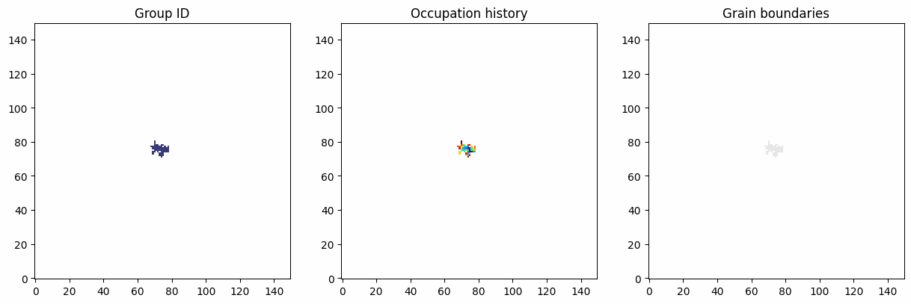
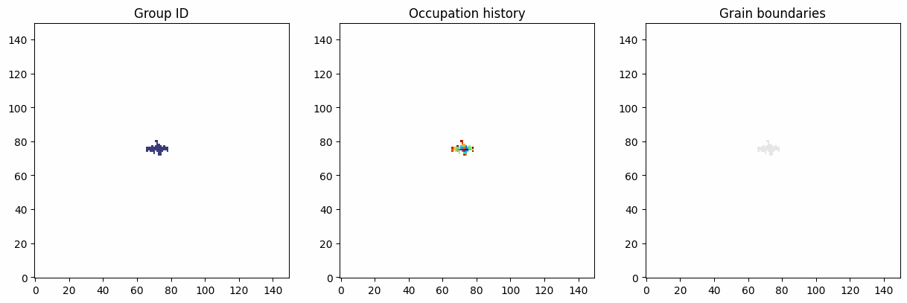
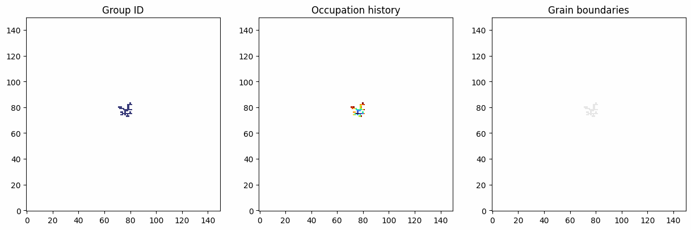
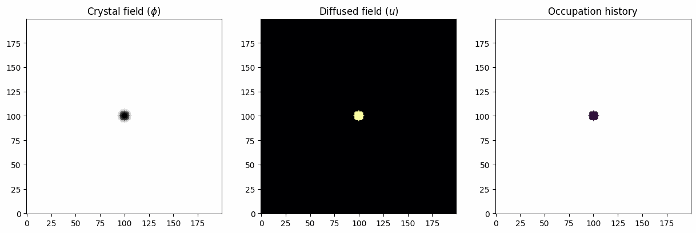
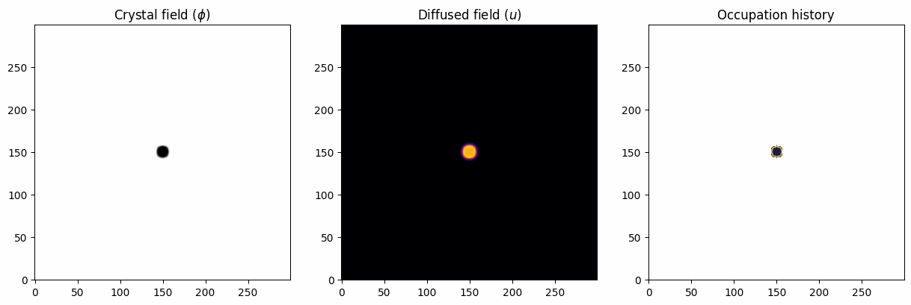

# Crystal-growth
This software is a lattice–based simulator for the growth of crystalline structures under different kinetic and continuous regimes, inspired by these papers [^1][^2][^3].
It implements various growing regimes, in both 2D and 3D. The regimes implemented in this software are:
   * EDEN growth: isotropic kinetic growth into a saturated enviroment
   * DLA growth: diffusion limited kinetic growth, where new particles reach the crystal via random walk
   * KOBAYASHI growth: growth by solidification into a saturated enviroment, taking into account crystal surface tension
   * STEFAN growth: growth by solidification into an enviroment whose saturation depends on a phisical field (temperature, concentration, ...) and on crystal surface tension
 
The software allows both a quantitative analysis, by computing relevant properties, and qualitative analysis, by plotting the final crystal, so that the user can directly see its final structure.


## Introduction
Crystals are solids where the building units, called *monomers* sit in a periodically ordered structure, repeating in space like a tiling. This long–range order is what gives crystals well–defined faces, sharp melting points, and very directional physical properties.

The main physical phenomena in which these objects are involved are:
* **Nucleation** - the birth of a new crystal from a melt, solution, or vapor: small clusters form, most die, a few exceed a critical size and become stable nuclei.
* **Growth** - atoms or molecules attach to the crystal surface, often controlled by diffusion (how fast stuff arrives) and interface kinetics (how fast it actually sticks and reorganizes).
* **Anisotropy** - because the lattice is not the same in every direction, properties like growth rate, surface energy, conductivity, optical index, etc. depend on orientation.
* **Defects** - vacancies, dislocations, impurities and grain boundaries break perfect order; they control mechanical strength, plasticity, transport, and often where and how growth proceeds.
* **Phase transitions** - crystals can melt, transform into other crystalline phases, or undergo order–disorder transitions when temperature, pressure, or composition change.


## Lattice implementation
This software implements a base lattice class called $\texttt{BaseLattice}$, and two derived classes: $\texttt{KineticLattice}$ for the kinetic simulations, and $\texttt{PhaseFieldLattice}$ for the continuous simulations.

### Base KineticLattice
The system is defined on a discrete cubic lattice

$$\Lambda = \{(x,y,z) | x=0,\dots,N_x-1, y=0,\dots,N_y-1, z=0,\dots,N_z-1\}$$

Each site carries some properties as function of $\mathbf{r}$, where $\mathbf{r} = (x,y,z)$:
* an **occupancy** variable $n(\mathbf{r}) \in \{0,1\}$
An empty cell is carachterized by a 0, an occupied one by a 1.
* an **hisotry** field $h(\mathbf{r}) \in \{-1,0,1,2,\dots \}$  
Where $h(\mathbf{r})=-1$ for empty sites, and $h(\mathbf{r})=t$ if the site was occupied at time step $t$.
The value $h(\mathbf{r})=0$ is designed for initial nucleation seeds.
* an **id** field $id(\mathbf{r})$, used to mimic different cristalline domains.
Each domain has to be tought as a crystaline island with a random local orientation with respect to the whole crystal (resulting into a policrystal).
* an optional **crystal seed set** $S_0 \subset  \Lambda$, used to define the initial occupied regions.
The simulation then grows the crystal around these seeds.
* a **verbose** flag, that prints additional information during the simulation if active.

This base class also implements some general utilities to interact with the lattice, such as $\texttt{is\\_point\\_inside()}$, that tells you if a point is inside the lattice space, and $\texttt{get\\_neighbors()}$, that gives the coordinates of the six neighbors (four in 2D) of a specific cell.\
It also declares the abstract method $\texttt{save\\_frame()}$ that every child class must implement: its function is to save in a directory some characteristic plots of the lattice at that specific time step.

### KineticLattice
This class hinerits everything from $\texttt{BaseLattice}$ without adding any data member.\
It implements lot of utilities methods that allow to interact with a kinetic lattice and retunr some important information during the simulation, such as the crystal bounding box, the list of the nucleation seeds and the active border.\
There is also a method that allows to set a new nucleation seed. For this lattice, a nucleation seed is just a cell with initial occupation and an hisotry value equal to zero.

### PhaseFieldLattice
This represents a continuous system in which a saturated liquid becomes locally solid and forms a crystal, therefore some new data memebers are implemented:
* the crystal field $\phi(\mathbf{r}) \in [0,1]$
This field has the same shape of the lattice, but each cell can assume any value between zero (completly liquid state) and one (complitly solid state)
* the diffused field $u(\mathbf{r})$ that represents the field (temperature, concentration, ...) coupled with the crystal field
* a variable **interface_threshold** that determines at which value of $\phi$ that cell is considered part of the crystal (by default 0.5)

This class also implements all the methods implemented in $\texttt{KineticLattice}$, adapted to the continuous logic.\
In this case the nucleation seeds are circular blobs of variable radius that have a value $\phi = 1$. 


## Particle Flux
This class represent an external bias for the growth.\
It consistes into a set of **preferred directions** along which the crystal is more likely to grow. It is also characterized by an intrinsic strength, that tells how relevant the bias is.

This flux **only works in kinetic simulations**!


## Growth models
This software implements four different growth models, two kinetic and two continuous.\
Each model is a class derived by the general class $\texttt{GrowthModel}$. Any new implemnted growth model must follow the same logic.

### GrowthModel class
This is the base class for every growth model implemented. It defines the logic any derived class must follow.\
Each model is characterized by:
* a **lattice** object that is directly modified in the routine
* an **rng seed** for the reproducibility
* a **three_dim** flag and a **verbose** flag

This class declares the crucial abstract method $\texttt{step()}$ that every derived class must implement: this method contains the evolution logic, and it is basically the beating heart of the simulation.\
It also defines the method $\texttt{run()}$, common for every growth model, whose function is to run the $\texttt{step()}$ routine for a determined number of epochs, so this method is the real engine of the software.

### EDEN growth
The Eden model is a kinetic simulation that uses $\texttt{KineticLattice}$ to describes growth controlled primarily by the interface kinetics into a saturated enviroment: the crystal expands by occupying sites randomly on its active border.\
At each epoch $t$:
1. Compute the active border $B(t)$.
2. Select a site $\mathbf{r} \in B(t)$ with a probability $P(\mathbf{r})$.
3. Set $n(\mathbf{r})=1$ and $h(\mathbf{r}) = t$.

In the isotropic case, all border sites are equivalent, resulting in a radially isotropic growth, as you can see in the following image.



With an external flux selected, each cell of the active border has an associated probability $P(\mathbf{r})$, biased using an anisotropy weight

$$w(\mathbf{r}) = e^{\mathbf{n}\cdot\mathbf{\alpha}_i}$$

where $\mathbf{n}$ is the surface normal and $\mathbf{\alpha_i}$ is the i-th flux direction.\
This way, the resulting probability is the weight normalized by the weights of the neighbors

$$P(\mathbf{r}) = \frac{w(\mathbf{r})}{\sum_{\mathbf{r'} \in B(t)} w(\mathbf{r'})}$$

This results into a biased isotropic growth, with wide branches along the flux directions.
For example, if the flux is along the directions $\pm\widehat{x}$ and $\pm\widehat{y}$, the result is a crystal with branches along the axes, as you can see in the following.




### DLA growth
The DLA model describes a kinetic growth in a non saturated enviroment, resulting in a growth limited by particle transport: particles diffuse in the empty region via random walk, and irreversibly attach to the crystal when they reach its neighborhood.

At each time step $t$, the simulation:
1. Defines a **generation bounding box** around the crystal, with padding $p_{gen}$.  
   A random starting position $mathbf{r}_0$ is selected on the surface of this box.
2. Defines as **outer bounding box** with larger padding $p_{out} > p_{gen}$.  
   If the particle exits this region or exceeds a maximum number of spacial steps, its walk is restarted from a new random generation point.
3. From $\mathbf{r_0}$, the new particle performs a random walk: $\mathbf{r}_{t+1} = \mathbf{r}_t + \mathbf{\Delta r}_t$  
   where $\mathbf{\Delta r}_t$ is the nearest-neighbor step, chosen according to a probability distribution that can be isotropic or not.
4. If at a given step the particle position $\mathbf{r}_t$ has at least one occupied neighbor, the particle irreveribly sticks to the crystal and the step ends, proceding with a new particle.

As in the EDEN model, a custom $\texttt{ParticleFlux}$ can be added to the simulation.\
Since the new particles are generated outside the crystal and reach it via random walk, the longer branches of the crtystal have higher probability to become even longer, resulting in the formation of a fractal crystal, as you can see in the image below.




### Kobayashi growth
The Kobayashi model is based on a $\texttt{PhaseFieldLattice}$, so it is a continuous simulation, where a liquid phase solidifies into a solid crystal, taking into account the crystal surface tension.\
The evolution is governed by the following differential equation:

$$
\frac{\partial\phi}{\partial t} = M
\left[ 
   \nabla\cdot\mathbf{J}(\phi) + R(\phi)
\right]
$$

where $M$ is the mobility of the system.\
In this equation, $\mathbf{J}$ is the anisotropic flux, defined as

$$
\mathbf{J} = \binom{J_x}{J_y} = \epsilon_0^2
\binom{(1+\delta \text{cos}(n\theta))^2\phi_x + n\delta \text{sin}(n\theta)(1+\delta\text{cos}(n\theta))\phi_y}
{(1+\delta \text{cos}(n\theta))^2\phi_y - n\delta \text{sin}(n\theta)(1+\delta\text{cos}(n\theta))\phi_x}
$$

The term $\epsilon_0$ determines the flux contribution, $\delta$ determines the strength of the anisotropy and $n$ is associated to the type of anisotropy (for example $n=4$ is associated to a squared anisotropy, $n=3$ to a triangular one and so on).\
On the other hand, $R(\phi)$ is the isotropic reaction term, defined as

$$
R(\phi) = \phi(1-\phi)(\phi - \frac{1}{2}+m)
$$

In this formula, $m$ is the supersaturation of the enviroment: a number between zero and one that tells how fast the crystal grows (the higher $m$, the faster it grows).

All these parameters can be decided by the user and given as input to the simulation.\
An example with $n=5$ can be seen in the picture below.



### Stefan growth
This simulation is similar to the Kobayashi one, but this time the crystal field is coupled to the diffused field via the supersaturation, which is now a function of the field itself $m=m(u)$. More specifically, it is defined as:

$$
m(u) = \frac{\alpha}{\pi}\text{arctan}
\left(
   \gamma(u_{eq}-u)
\right)
$$ 

where $\gamma$ sets the strength of the diffused field.\
The diffused field is then evolved according to the following differential equation:

$$
\frac{\partial u}{\partial t} = D \nabla^2 u + K\frac{\partial\phi}{\partial t}
$$

where $D$ is the diffusivity of the field and $K$ the latent heat coefficient.

This simulation will produce crystal with dendrites, similar to a snowflake. This is due to the latent heat coefficient being different from zero: sharp and long branches will lose heat faster, resulting in a faster solidification of their surroundings, becoming longer faster and faster.

An example of a snowflake like crystal produced with this simulation is in the figure below, showing both the occupation history and the diffused field at the end of the simulation.




## Outputs and Analysis tools
The software mainly focuses on the production of the imgaes of the crystal produced during the simulation.\
For each simulation, the software saves into a directory the $\texttt{.log}$ file, containing all the informations of the run, and some final images. These images include:
1) An animated GIF file that shows the full growth of the crystal. For kinetic simulations the evolution of the occupation history, the crystalline domain and the grain boundatries are produced, for the phase field simulations the $\phi$ and $u$ field are reported, together with the occupation history.
2) The final result for each type of plot (crystal field, diffused field, occupation history, ...). The plots of the crytalline domain and the grain boundaries are saved only if the number of initial nucleation seeds in the simulation is bigger than one.

If the output direcotry is not specified by the user, the software creates one called *$DATE_$HOUR_$SIMULATION_TYPE*.

Additionally to that, for the DLA simulation an analysis of the Hausdorff dimention is performed. This quantity is calculated only for this simulation since it produces fractal crystal, and this quantity is the mathematical definition of dimention for such a shape. This is computed via box-counting over multiple length scales: if $N(l)$ is the number of occupied boxes of side $l$, the dimension $D_f$ is estimated from:

$$N(l) \approx l^{-D_f}$$

Further metrices or interesting quantitative analysis may be computed and defined also from an external user, since in the simulation, the property of the $\texttt{Lattice}$ object is always of the user.


## Repository Structure
The software repository has the following structure.
It is subdivided in directories according to the code logic.
``` 
\CRISTAL-GROWTH
├───main.py
├───simulations.py
├───requirements.txt
├───classes
│   ├──BaseLattice.py
│   ├──DLAGrowth.py
│   ├──EDENGrowth.py
│   ├──GrowthModel.py
│   ├──KineticLattice.py
│   ├──KobayashiGrowth.py
│   ├──ParticleFlux.py
│   ├──PhaseFieldLattice.py
│   └──StefanGrowth.py
├───GUI
│   ├──GUI.py
│   ├──gui_kinetic.py
│   ├──gui_phase_field.py
│   └──gui_routines.py
├───images
├───inputs
├───tests
└───utils
    ├───Analysis.py
    ├───ArgParser.py
    ├───logger.py
    └───paths.py
``` 

The only file the user requires to call for running every possible simulation is the file $\texttt{main.py}$.

## Getting Started
This software is tested working in the python 3.10 version.

1. Clone the repository: inside the target directory, clone this repo by writing the following in the command prompt
``` 
git clone https://github.com/MatteoAgu12/Crystal-growth
``` 
   If the repository has been successfully installed, you should be able to see it after entering the following command in the terminal
``` 
ls
``` 

2. Move to the software directory with
``` 
cd ./Crystal-growth/
``` 
   and install all the required dependencies by executing (*pip* version, use your enviroment otherwise)
``` 
pip install -r requirements.txt
```

By doing these few steps you should be ready to use the software on your machine.


## Tutorials
The usage of this software is very easy, and to help the user to learn the main features the following short tutorials are provided, covering all the possibilities offered by this work.\
The simulation are controlled by a configuration file in format $\texttt{.ini}$, and in the directory $\texttt{inputs/}$ an example of such a file for each simulation is reported, to fyrther help the first steps of the user.

### Run a built-in simulation
This very important section is about how to write the $\texttt{.ini}$ file to control your simulation.

Let's start by the comments: the input file supports the comments done in a python way, starting with the hashtag (#).

There are three mandatory parameters, without which the simulation doesn't even start:
* *simulation*: the type of simulation (EDEN, DLA, KOBAYASHI, STEFAN)
* *size*: in the format NX, NY, NZ, representing the size of the lattice that hosts the crystal
* *epochs*: the number of steps to be performed.

There are then some parameters which are global, so that can be used in every simulation:
* *output*: the name of the output directory. If not specified (or not existing), it is automatically generated.
* *two_dim*: can be *true* or *false*. Remember that phase field simulations only support 2D. Default true.
* *seeds*: the number of initial seeds to be put in the simulation. If it's one the seed is placed in the center, if thera are more they are randomly scattered in the lattice. Default 1.
* *verbose*: can be *true* or *false*. Default false.
* *frame_freq*: the frequency at which the status of the simulation is saved to produce the final GIF file. Default to 50.
* *external_flux*: only implemented for kinetic simulations, a sequence of three coordinates defining the directions (for example if I wanto $\pm\widehat{x}$ directions I write 1 0 0 -1 0 0). Default to None.
* *flux_strength*: strength of the external flux. Defult tom zero.

There are additional optional parameters only for the phase field simulations. These are:
* *interface_thr*: a value between zero and one that determines when a cell with a specific $\phi$ value is considered a crystal. Default to 0.5.
* *epsilon0*: base flux strength. Defualt to zero.
* *delta*: anisotropy strength. Default to zero.
* *n_folds*: number of symmetries. Default to zero (isotropic).
* *mobility*: mobility of the crystal field. Default to zero.
* *dt*: time interval considered when discretizing the time derivative. Default to 1e-4.
* *supersaturation* (Kobayashi only): constant supersaturation in the Kobayashi equation. Default to zero.
* *alpha* (Stefan only): coupling parameter between the crystal and diffused fields. Default to zero.
* *gamma* (Stefan only): smooth of the arctangent in the supersaturation relation. Default to 10.
* *diffusivity* (Stefan only): diffusivity of the diffused field. Default to zero.
* *latent_coef* (Stefan only): latent heat coefficient. Default to zero.
* *u_equilibrium* (Stefan only): value of $u$ at which the crystal in the solid phase is in equilibrium. Default to one.
* *U_infinity* (Stefan only): initial value of the diffused field in the liquid enviroment. Default to zero.

Once you write your configuration file, to run the simulation you have to prompt
```
python main.py $PATH_TO_THE_INI_FILE
```
If you execute the main file with no path associated, the software warns you and gives you an example of a possible $\texttt{.ini}$ file to use.


### Create and use a custom $\texttt{Lattice}$ object
Instead of running the simulation implemented in the software, you can also create and modify your own lattice object, both by importing one class defined in the softawre, or by defining a new lattice which is a child of the $\texttt{BaseLattice}$ class.

For example, let's create an object of the class $\texttt{KineticLattice}$.
```python
from classes.KineticLattice import KineticLattice

NX, NY, NZ = [100, 100, 1]
VERBOSE = True
LATTICE = KineticLattice(NX, NY, NZ, VERBOSE)
```
This will create a 3D 100x100x100 lattice, that when used prints additional information thanks to the verbose flag.\
Let's now define a nucleation seed in a certain point with a safe routine.
```python
X, Y, Z = [30, 68, 0]
if not LATTICE.is_occupied(X, Y, Z):
   LATTICE.set_nucleation_seed(X, Y, Z)
```
You can play with the class to discover all the functionalities.

### Create your custom simulation
With the lattice objects and all the models in the $\texttt{class}$ folder, you can build your own simulation.\
For example, let's create a DLA simulation that defines a growth from an active surface: this simulation mimics what can happen inside a lithium battery, where the lithium monomers are collected on an electrode, forming crystal structures and branches that in the old gen batteries caused dangerous shortcircuit, with the self ignition of the battery itself.

```python
from classes.KineticLattice import KineticLattice
from classes.ParticleFlux import ParticleFlux
from classes.DLAGrowth import DLAGrowth
import GUI.GUI as GUI

LATTICE = KineticLattice(20, 20, 150, True)  # the xy plane is the active surface, the crystal grows along z

for x in range(50):
   for y in range(50):
      LATTICE.set_nucleation_seed(x, y, 0, maintain_last_id=True)   # to have only a crystalline domain

MY_FLUX = ParticleFlux(flux_directions=[0, 0, 1], strength=10.0, verbose=True)   # flux coming from z-dir
model = DLAGrowth(lattice=LATTICE,
                  generation_padding=1,
                  outer_limit_padding=3,
                  external_flux=MY_FLUX,
                  three_dim=True,
                  verbose=True)

EPOCHS = 4000
save_freq = 20    # saves a frame every 20 steps
OUT_DIR = "OUTPUTS/SURFACE/"
TITLE = "My custom simulation"
frame_list = []
model.run(EPOCHS, callback=LATTICE.save_frame, 
          save_freq=save_freq, frame_dir=OUT_DIR, frame_list=frame_list)
if frame_list:
        GUI.create_gif(frame_list, OUT_DIR, TITLE)

# Plot the final result
GUI.plot_kinetic_lattice(LATTICE, 
                         EPOCHS, 
                         title=TITLE, 
                         three_dim=True, 
                         out_dir=OUT_DIR)
```

This simulation will produce the following result.


### Running the tests
You can run each test module with $\texttt{pytest}$ by executing the following commands from the software folder
```
pytest tests/*
```


## References
[^1]: T. A. Witten & L. M. Sander, *Diffusion-Limited Aggregation, a Kinetic Critical Phenomenon*, Phys. Rev. Lett. 47, 1400–1403 (1981).\
[^2]: R. Kobayashi, "Modeling and numerical simulations of dendritic crystal growth", Physica D: Nonlinear Phenomena, 63(3-4), 410-423 (1993).\
[^3]: A. Karma & W. J. Rappel, "Quantitative phase-field modeling of dendritic growth in two and three dimensions", Physical Review E, 57(4), 4323 (1998).